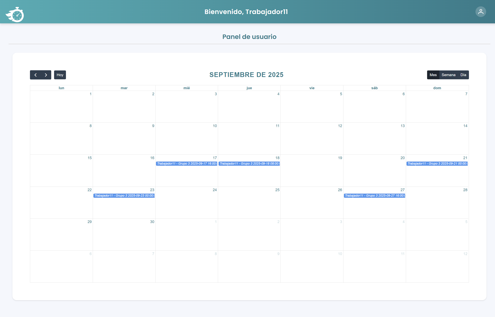

# 🗂️ TurnoMaster

## 📌 ¿Qué es TurnoMaster?

**TurnoMaster** es una aplicación web para la **gestión de turnos en pequeños y medianos comercios**.  
El sistema permite administrar horarios, gestionar empleados y generar cuadrantes de trabajo de forma eficiente, optimizando la organización y la comunicación interna entre la empresa y los empleados.  

Este proyecto fue desarrollado como parte de la **Formación en Centros de Trabajo (FCT)** en el **CFGS de Desarrollo de Aplicaciones Web**.

---

## 🚀 Tecnologías utilizadas  

- **Backend:** Spring Boot (Java)  
- **Frontend:** Angular (JavaScript)  
- **Base de datos:** PostgreSQL  
- **Herramientas:** Docker, DBeaver, Bruno API  

---

## 🔐 Autenticación  
- Inicio de sesión y registro de usuarios con roles diferenciados (**Administrador** / **Empleado**).  

   

---

## 📊 Panel de Administrador  

Panel principal para la gestión y creación de usuarios, grupos y turnos.  

  

---

## 👨‍💼 Panel del Empleado  

El trabajador puede acceder a su panel personal, donde consulta de manera sencilla los **turnos asignados**.  

  

---

## ⚙️ Funcionalidades principales  

### 👥 Gestión de grupos

Panel donde se puede ver y borrar fácilmente los grupos existentes.
  

También podrá crear tantos grupos como quiera para organizar a sus trabajadores.
  

### 👤 Gestión de usuarios  

Panel donde se pueden visualizar y borrar fácilmente los usuarios existentes.
  

También podrá añadir nuevos usuarios.
  

### 🔄 Gestión de turnos

Panel donde se pueden visualizar y borrar los turnos.
 

Podrá crear turnos sin necesidad de crear un cuadrante.
  

### 🗓️ Creación de cuadrantes  

Panel para la generación de cuadrantes de trabajo en formato, los cuáles se podrán exportar en formato **PDF**.  

El usuario podrá seleccionar el rango de fechas del cuadrante que va a crear.
  

A continuación, tendrá un calendario donde podrá visualizar todos los turnos existentes, borrarlos y moverlos de un día para otro de manera sencilla.
  

Haciendo click en un día, le permitirá añadir un turno seleccionando el usuario o grupo al que le va a asignar ese turno.
  

### 📑 Ejemplos de cuadrantes exportados  
Una vez se exporten los cuadrantes a **PDF** se verán de la siguiente manera:

  
  

---

## 👥 Autores  

- [@JuanPa0991](https://github.com/JuanPa0991)  
- [@alexpoedev](https://github.com/alexpoedev)  
- [@albamdls](https://github.com/albamdls)

Con la ayuda y colaboración de [@alvarorodriguezestruch](https://github.com/alvarorodriguezestruch) ✨
