# 🗂️ TurnoMaster

## 📌 ¿Qué es TurnoMaster?

**TurnoMaster** es una aplicación web para la **gestión de turnos en pequeños y medianos comercios**.  
El sistema permite administrar horarios, gestionar empleados y generar cuadrantes de trabajo de forma eficiente, optimizando la organización y la comunicación interna entre la empresa y los empleados.  

Este proyecto fue desarrollado como parte de la **Formación en Centros de Trabajo (FCT)** en el **CFGS de Desarrollo de Aplicaciones Web**, utilizando:  
- **Spring Boot (Java)** para el backend.  
- **Angular (JavaScript)** para el frontend.  
- **PostgreSQL** como sistema de base de datos.  
- **Docker**, **DBeaver** y **Bruno API** como herramientas de apoyo.  

---

## 🚀 Tecnologías utilizadas  

- **Backend:** Spring Boot (Java)  
- **Frontend:** Angular (JavaScript)  
- **Base de datos:** PostgreSQL  
- **Herramientas:** Docker, DBeaver, Bruno API  

---

## 🔐 Autenticación  
- Inicio de sesión y registro de usuarios con roles diferenciados (**Administrador** / **Empleado**).  

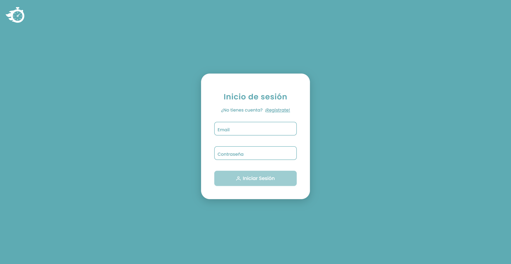  
  

---

## 📊 Panel de Administrador  

Panel principal para la gestión de usuarios, grupos y turnos.  

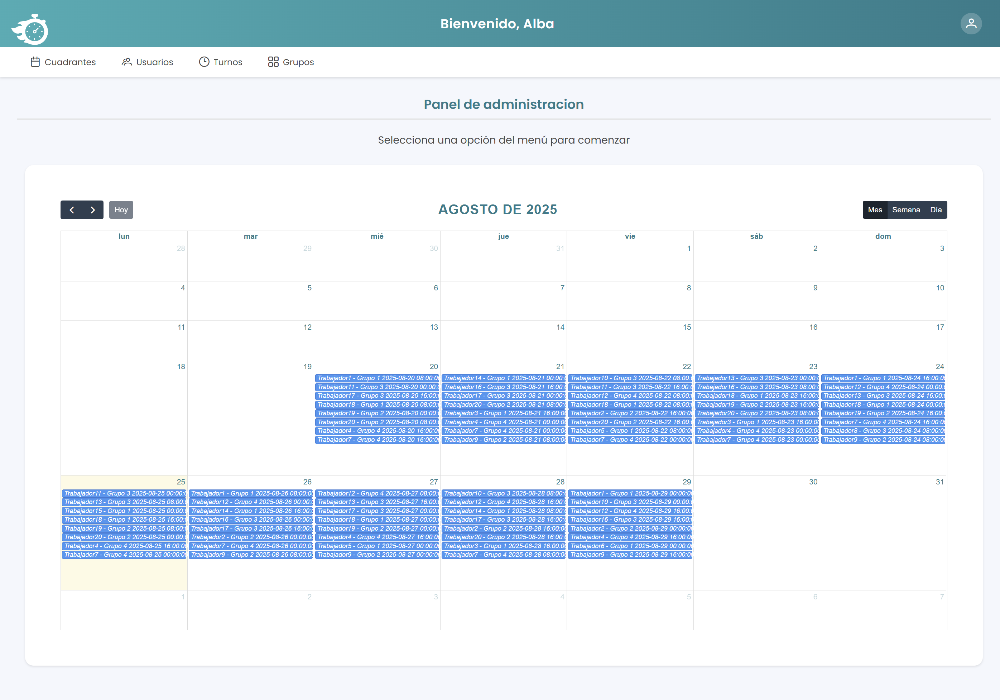  

---

## 👨‍💼 Panel del Empleado  

El trabajador puede acceder a su panel personal, donde consulta de manera sencilla los **turnos asignados**.  

  

---

## ⚙️ Funcionalidades principales  

### 👥 Gestión de grupos  
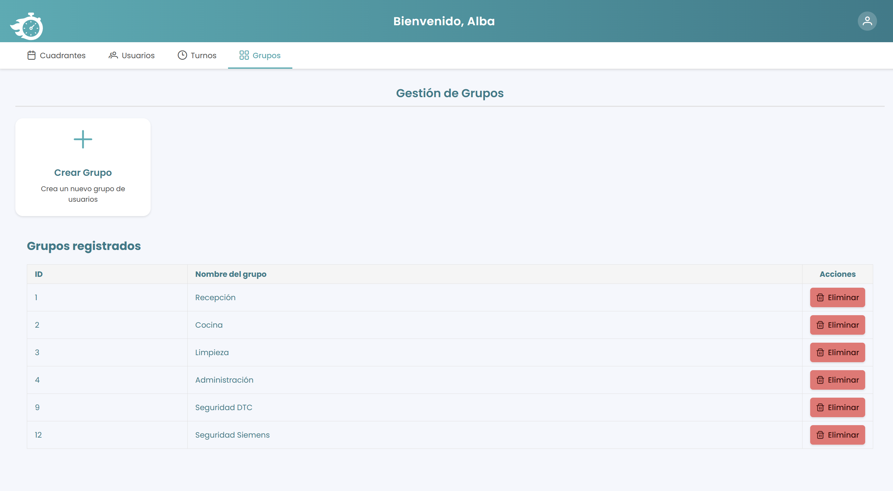  
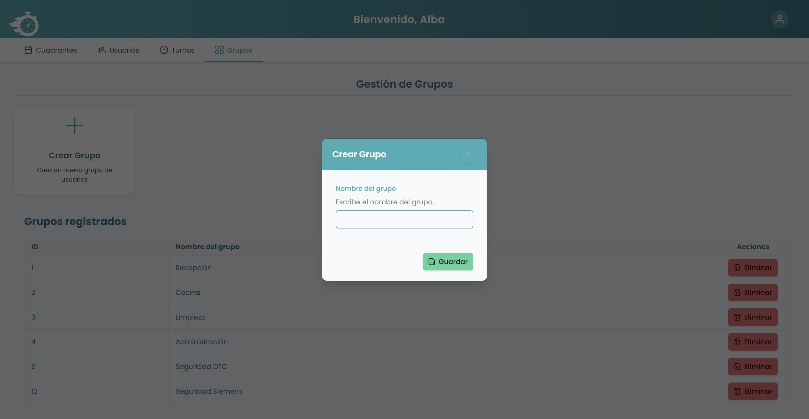  

### 👤 Gestión de usuarios  
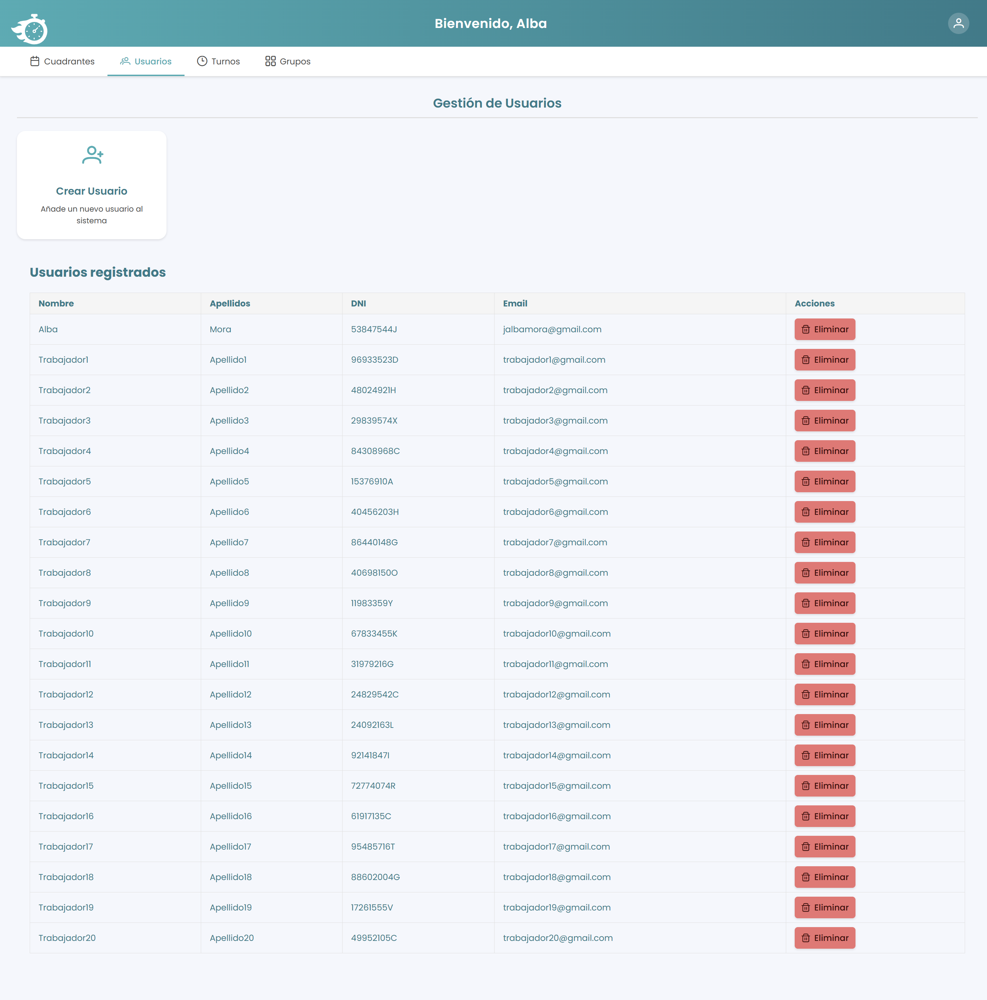  
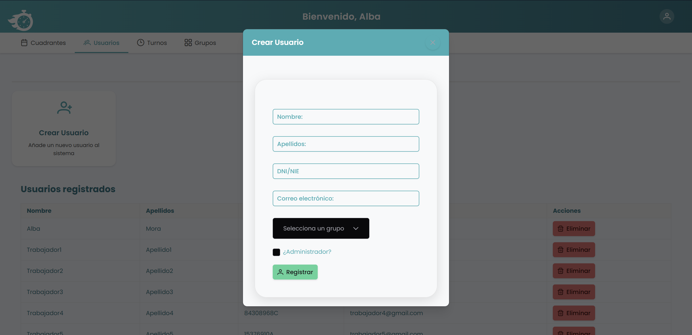  

### 🔄 Gestión de turnos  
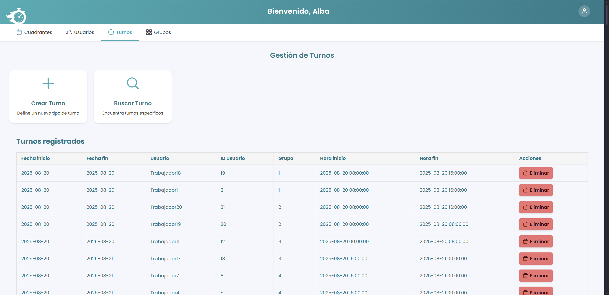  
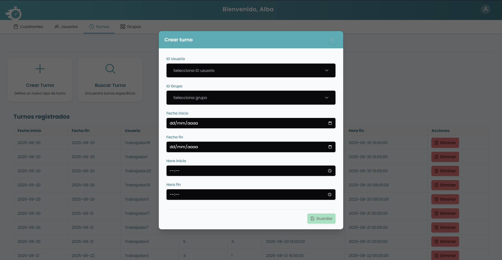  

### 🗓️ Creación de cuadrantes  
Generación automática de cuadrantes de trabajo en formato **PDF**.  

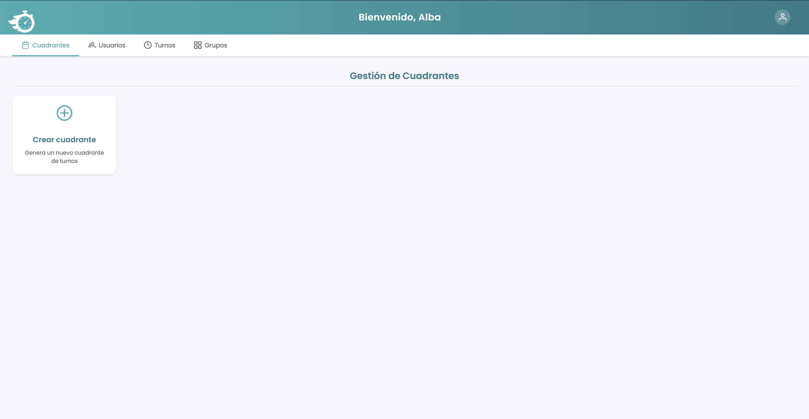  
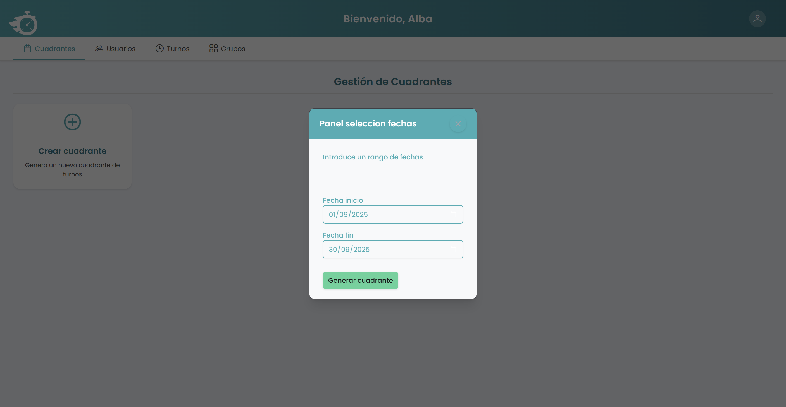  
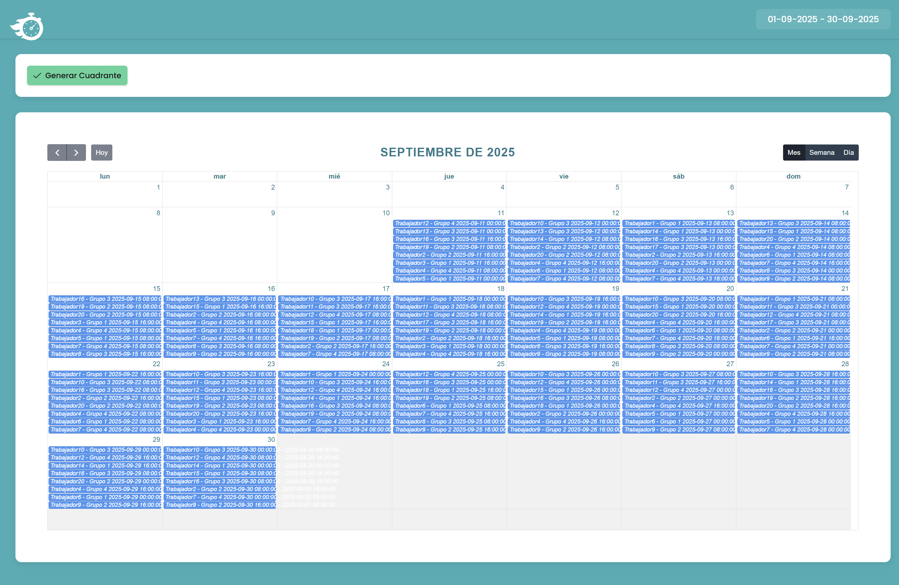  
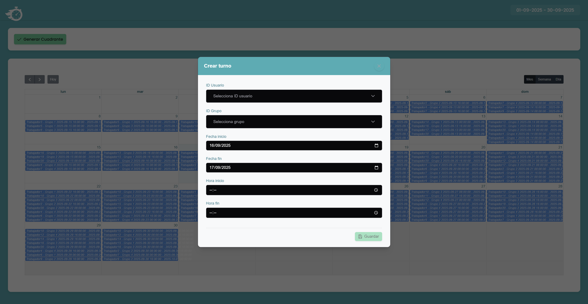  

### 📑 Ejemplos de cuadrantes exportados  
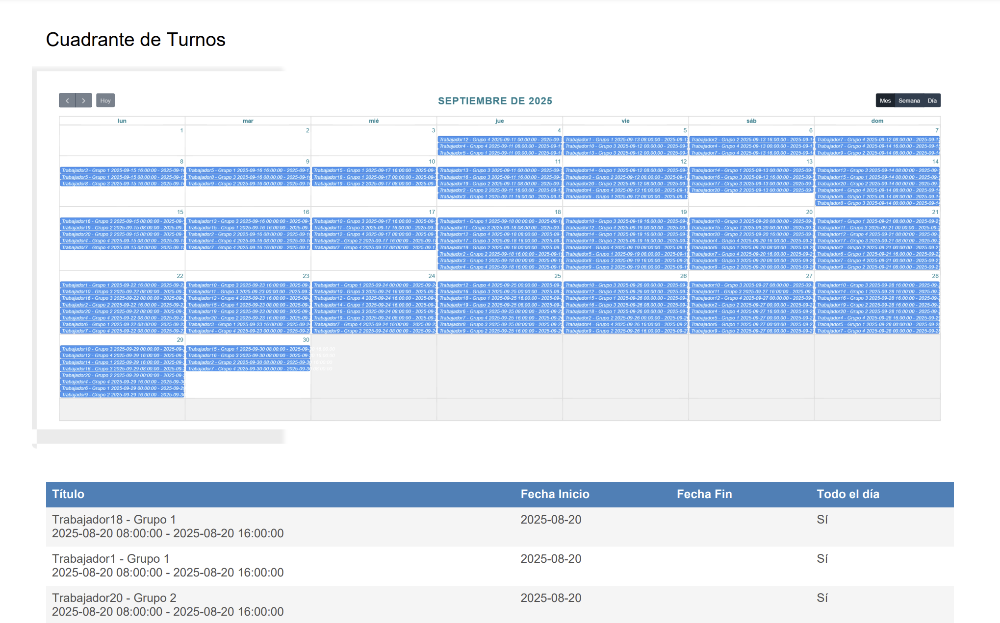  
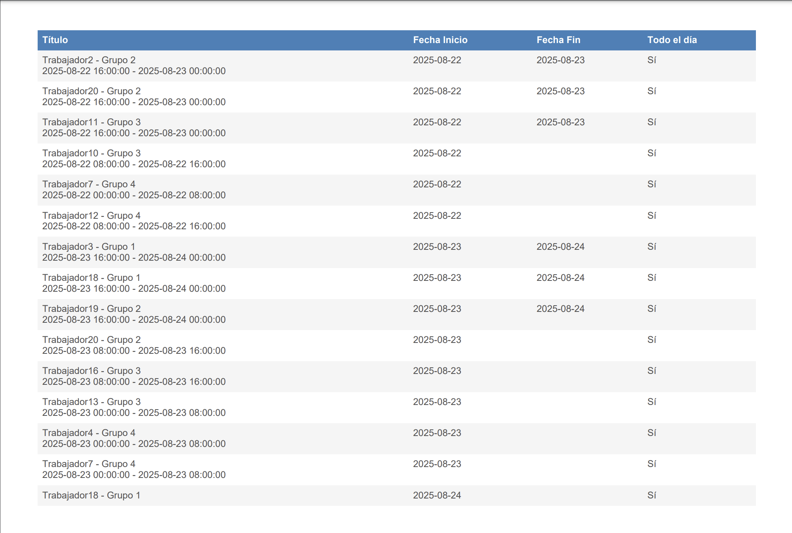  

---

## 👥 Autores  

- [@JuanPa0991](https://github.com/JuanPa0991)  
- [@alexpoedev](https://github.com/alexpoedev)  
- [@albamdls](https://github.com/albamdls)  
